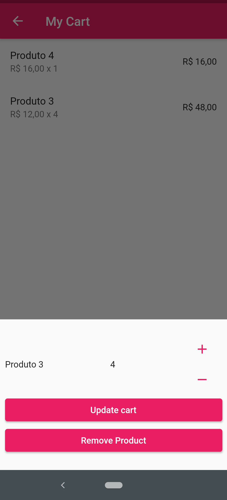

# #LevelUP5 | Raro Academy  
  
## MyCart  
Shopping cart built with Flutter in the Raro Academy Training.  

## Result  

  
  
  
  
</
>  

## Screens  
- Shopping page
- Cart page

## Dependencies
- mobx: ^2.0.1
- flutter_mobx: ^2.0.0
- build_runner: ^2.0.6
- mobx_codegen: ^2.0.1+3
  